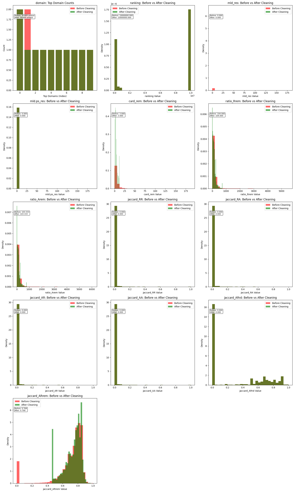

# Lab 02-DataCleaning - This lab is about loading a security dataset assessing the quality such as missing values duplicates outliers and clean the data to prepare a good clean dataset for further analysis

- **Student Name:** __Gurmandeep Deol__
- **Student ID:** __104120233__
- **Lab Number:** __Lab02-DataCleaning__
- **Completion Date:** __2025-09-20__
- **Course:** __SRT521 - Advanced Data Analysis for Security__
- **Course Section Number:** __(NBB)__

## Lab Objectives
- __Assess and evaluate data quality issues in security dataset__
- __Implement data cleaning strategies for phishing detection data__
- __Apply domain validation rules for cybersecurity features__
- __Validate cleaning results and ensure data integrity for machine learning__
- __Document cleaning decisions and their impact on dataset utility__

## Dataset Information
- **Dataset Name:** __Phishing Detection Dataset (dataset5.csv)__
- **Source:** __https://www.kaggle.com/datasets/mdsultanulislamovi/phishing-website-detection-datasets__
- **Size:** __95,991 rows 14 columns, 11.7mb After cleaning 95,990 rows 14 columns__
- **Domain:** __Phishing__

## Key Findings
- __My key findings I found are that in total I had 920 missing values about 0.07% of the dataset the top 10 columns that had the missing values are listed below I had 1 duplicate row after cleaning filling in the missing data and handling invalid values I was able to retain over 70% of the data and my data had more legitimate attacks than phishing before and after cleaning which is a good thing__
- __Below are images showing before and after cleaning__

## Technical Implementation
- **Algorithms Used:** __Algorithms I used are missing value imputation to fill in missing values and I used outlier detection to detect outliers and data validation to make sure the data was valid and data type conversion to fix the formatting issues convert text into numbers as that is easier for machines to understand__
- **Libraries:** __pandas,numpy,matplotlib,seaborn,pathlib__
- **Preprocessing Steps:** __Parsing the csv using latin1 encoding because there was messy data than I converted the object columns to numeric types than I fixed the missing values and removed duplicate rows__
- **Model Performance:** __After cleaning the data there were 0 missing values and 0 duplicates and 70 percent of the dataset was preserved__

## Challenges and Solutions
- __some issues i faced were that I could not load the csv at the beginning because the data was so messy panda was not able to read it Another issue I faced was some features were stored as text instead of numbers which caused issues when trying to do math operations__ 
- __For the first challenge I solved it by using defensive parsing with latin1 encoding and special error handling parameters to properly read the messy data and for the second issue I used data type conversion to safely convert these columns to numeric format.__

## Reflection
- __I learned how to clean a messy dataset while still maintaining the data quality and keeping over 70% of the original dataset. This lab taught me how to understand that different features requires different cleaning strategies__
- __This relates to real world phishing detection system where clean validated data is needed for accurate threat detection. This cleaned dataset can be used for training machines to detect malicious website.__
- __Next time I would actually try to put this dataset into a machine learning to see how it uses it to detect malicious domains and non malicious__

## Files Description
- `lab-02-data-cleaning.ipynb` - Main lab notebook with analysis
- `outputs/` - Generated plots, model files, results
- `data/` - Dataset files (if applicable)
- `images/` - Screenshots and diagrams