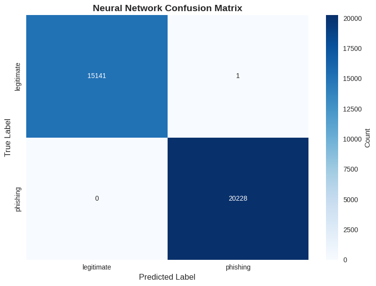

# Lab 6 part 2 deep learning fundamentals - Phishing Detection

**Student Name:** Gurmandeep Deol  
**Student ID:** 104120233  
**Lab Number:** Lab06 part 2  
**Completion Date:** 2025-11-07  
**Course:** SRT521 - Advanced Data Analysis for Security  
**Course Section Number:** NBB  

## Lab Objectives
- Build and train your first neural network using PyTorch
- Implement proper data preprocessing for deep learning
- Apply activation functions and regularization techniques
- Compare neural networks with traditional ML models
- Visualize training progress and analyze model performance
- Save and load trained neural network models
- Understand overfitting patterns and prevention strategies

## Dataset Information
- **Dataset Name:** engineered_dataset4.csv
- **Source:** Lab 3 Output Dataset
- **Size:** 5 rows, 68 columns, 77.0 MB
- **Domain:** Phishing

## Key Findings
### Model Performance 
```
=== Neural Network Test Results ===
Test Loss: 0.000197
Test Accuracy: 1.0000
Test Precision: 1.0000
Test Recall: 1.0000
Test F1 Score: 1.0000
Test ROC AUC: 1.0000
```
```
=== Classification Report ===
              precision    recall  f1-score   support

  Legitimate       1.00      1.00      1.00     15142
    Phishing       1.00      1.00      1.00     20228

    accuracy                           1.00     35370
   macro avg       1.00      1.00      1.00     35370
weighted avg       1.00      1.00      1.00     35370
```

### error analysis
```
total errors: 1 misclassification
false positives 1 (flagged 1 legit url as phishing)
false negatives 0 (caught all phishing attempts)
```
### Feature Importance
```
=== Top 15 Most Important Features ===
 1. URLSimilarityIndex                 : 0.136110
 2. Security_Risk_Score                : 0.005027
 3. IsHTTPS                            : 0.004507
 4. SpacialCharRatioInURL              : 0.002867
 5. LargestLineLength                  : 0.001612
 6. LetterRatioInURL                   : 0.001436
 7. DegitRatioInURL                    : 0.001351
 8. NoOfImage                          : 0.000797
 9. NoOfSelfRef                        : 0.000656
10. URL_Domain_Length_Ratio            : 0.000362
11. LineOfCode                         : 0.000356
12. NoOfExternalRef                    : 0.000339
13. Content_URL_Ratio                  : 0.000237
14. NoOfLettersInURL                   : 0.000198
15. DomainLength                       : 0.000153
```

### traditional model comparsasion
```
=== MODEL COMPARISON TABLE ===
Model	Accuracy	Precision	Recall	F1 Score	ROC AUC
0	Neural Network	1.0000	1.0000	1.0000	1.0000	1.0
1	Random Forest	1.0000	1.0000	1.0000	1.0000	1.0
2	Logistic Regression	0.9999	0.9999	0.9999	0.9999	1.0
```

```
=== Model Comparison Analysis ===
🏆 Best performing model: Random Forest (Accuracy: 1.0000)
🧠 Neural Network accuracy: 1.0000
📊 Neural Network vs Random Forest: -0.0000
💡 Neural Network improvement potential: Low - already
```
### Neural network achieved almost identical performance to random forest demonstrating efficiency and production-readiness
## Technical Implementation
### Algorithms Used: 
- **Libraries:** 
- **Deep Learning: PyTorch torch.nn torch,optim**
- **Data Processing: pandas,numpy,scikit-learn**
- **Visulalization: matplotlib,seaborn**
- **Model Presistence: pickel,torch.save/load**
- **Metrics: sklearn.metrics(accuracy,precision,recall,f1,roc_auc,confusion_matrix)**
### Preprocessing Steps:
- **dropped non-numeric columns such as FILENAME,URL,Domain**
- **removed label column and stored separately**
- **verified no missing values**
- **spilt data: 70% train,15% validation, 15% test** 
- **converted to PyTorch tensors**
- **created DataLoaders with batch size=64**
Device: CUDA(GPU-accelarted)
### Model Performance


## Challenges and Solutions
- **The first challenge I faced was weights_only was set to true which crashed PyTorch**
- **The second challenge was initially I tried doing this lab on my vscode but it would not work it would not detect a gpu**
- **The solution for the first challenge was to enable weights_only to false**
- **The solution to the second challenge was to go to google colab and select t4 GPU that way the code ran with the GPU**
## Reflection
- **I learned how to build neural networks from scratch understanding the design making the gpu work with it to ensure good performance I also learned to split the dataset into train/validation/test I also learned that Neural Network models can match traditional models and even be better than models like random forest**
- **This relates to security application because this model can be deployed in web browsers email filters to detect malicious urls with great accuracy up ti 99.997 accuracy This model also caught zero false negatives which means it caught all of the phishing attempts excellent for security applications**

## Files Description
- `lab_06_part2_deep_learning_Gurmandeep_Deol.ipynb` - Main lab notebook with analysis
- `outputs/` - Generated plots, model files, results
- `saved_models/` - contains saved models
- `README.md` - README documentation