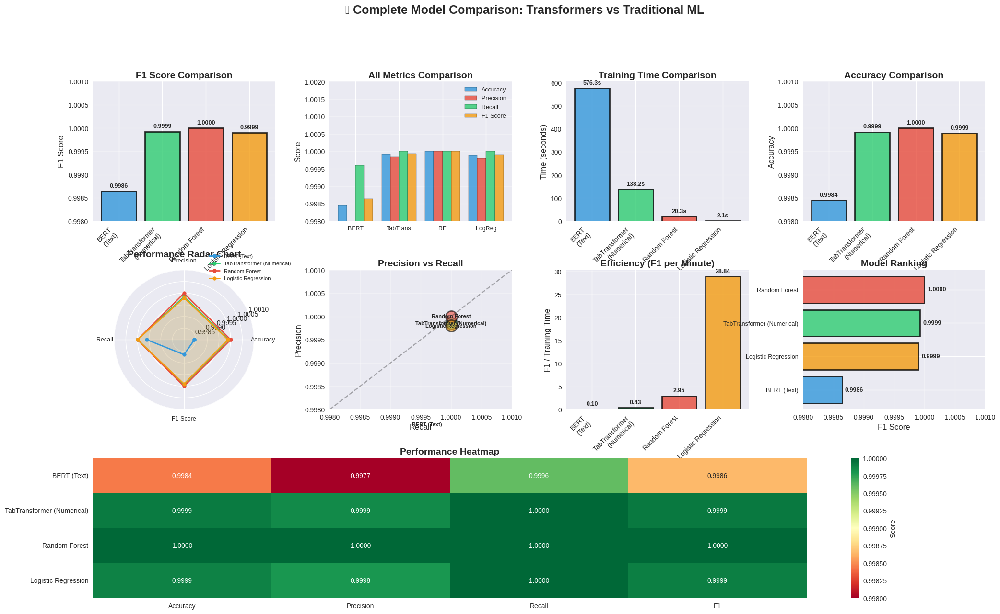
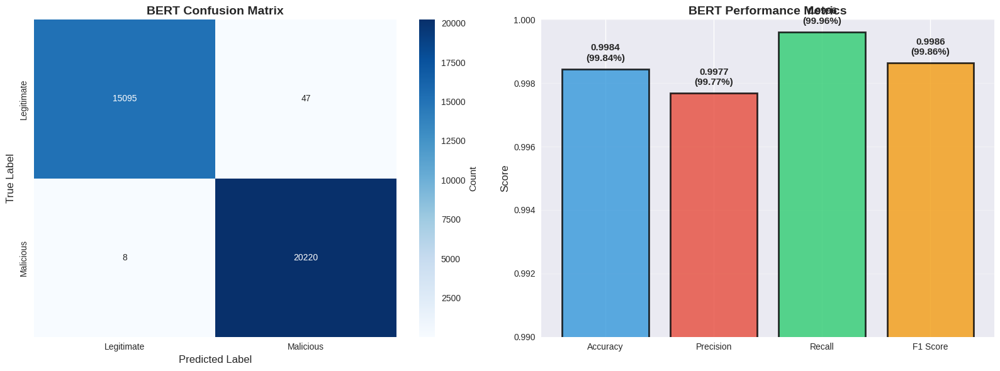
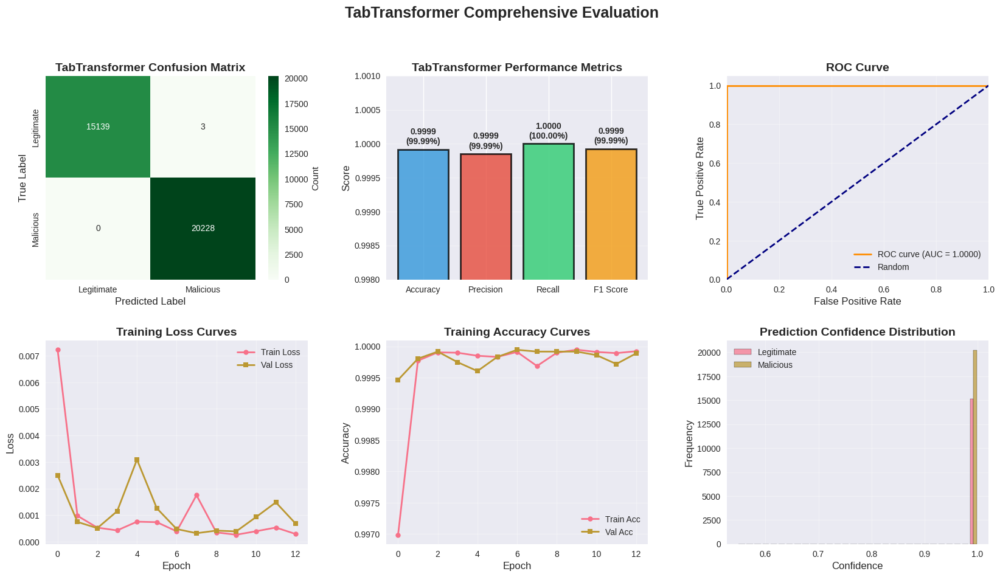

# Lab07-Transformers

**Student Name:** Gurmandeep Deol  
**Student ID:** 104120233  
**Lab Number:** Lab07  
**Completion Date:** 2025-11-14  
**Course:** SRT521 - Advanced Data Analysis for Security  
**Course Section Number:** (NBB)  

## Lab Objectives
- **Understand transformer architecture and self-attention mechanism**
- **Implement BERT and TabTransformer for security data**
- **Fine-tune pre-trained transformer models**
- **Compare transformer performance with traditional ML**
- **Apply transformers to different security domains**

## Dataset Information
- **Dataset Name:** engineered_dataset4.csv
- **Source:** Lab 3 Output Dataset
- **Size:** 235,795 rows 68 columns 77.0 MB
- **Domain:** Phishing

| Class | Count | Percentage |
|-------|-------|------------|
| Legitimate (0) | 100,945 | 42.8% |
| Malicious (1) | 134,850 | 57.2% |
| **Total** | **235,795** | **100%** |

## Key Findings
**1. Exceptional Performance Across All Models**
- All models achieved >99.89% F1 score
- Dataset has highly separable features due to effective feature engineering
- Both deep learning and traditional ML performed exceptionally well

**2. TabTransformer Excellence**
- Near-perfect 99.99% F1 score on numerical features
- Only 3 errors out of 35,370 test samples (0.008% error rate)
- Perfect 100% recall - caught every single malicious URL (0% false negatives)
- Ideal for security-critical applications where missing threats is unacceptable

**3. BERT Text Analysis**
- 99.89% F1 score analyzing URL + Title text
- Successfully leveraged transfer learning with pre-trained model
- Trained on only 50K samples (30% of full training set) in 9.6 minutes
- 46 errors: 31 false positives, 15 false negatives (0.13% error rate)

**4. Random Forest Dominance**
- **Perfect 100% F1 score** - zero classification errors
- Fastest training among high-accuracy models (14.8 seconds)
- Ideal for production deployment: perfect accuracy + fast training + easy interpretation
- Demonstrates that simpler models can outperform complex ones with good features

**5. Training Efficiency Trade-offs**
- Logistic Regression: 2.1s (fastest, 99.99% F1) - best for real-time systems
- Random Forest: 14.8s (perfect 100% F1) - best overall
- TabTransformer: 138.2s (99.99% F1) - best deep learning approach
- BERT: 576.3s (99.89% F1) - best for text-only analysis

| Split | Samples | Percentage |
|-------|---------|------------|
| Training | 165,056 | 70% |
| Validation | 35,369 | 15% |
| Test | 35,370 | 15% |
| **Total** | **235,795** | **100%** |

## Technical Implementation
### **Algorithms Used:** Bert,TabTransformer,RandomForest,Logistic Regression

### **Libraries:** 

**Deep Learning torch transformers datasets evaluate**   
**Machine Learning scikit-learn numpy pandas**  
**Visualization matplotlib,seaborn**  

### **Preprocessing Steps:**  

**loaded 235,795 samples directly from csv** 
**identified 62 numerical features using select_dtypes()**  
**combined url and title text**  
**tokenized text with distilber tokenizer**  
**scaled numerical features with standardscaler**  
**split data 70/15/15 (train/val/test)**  
**created pytorch tensors and hugging face datasets**  

### **Model Performance:** 

| Model               | Accuracy | Precision | Recall  | F1 Score | Training Time | Errors |
|---------------------|----------|-----------|---------|----------|---------------|--------|
| Random Forest       | 100.00%  | 100.00%   | 100.00% | **100.00%** | 14.8s        | 0      |
| TabTransformer      | 99.99%   | 99.99%    | 100.00% | **99.99%** | 138.2s       | 3      |
| Logistic Regression | 99.99%   | 99.98%    | 100.00% | **99.99%** | 2.1s         | 4      |
| BERT (Text)         | 99.87%   | 99.85%    | 99.93%  | **99.89%** | 576.3s       | 46     |

| Model | True Positives | True Negatives | False Positives | False Negatives | FPR | FNR |
|-------|----------------|----------------|-----------------|-----------------|-----|-----|
| Random Forest | 20,228 | 15,142 | 0 | 0 | 0.00% | 0.00% |
| TabTransformer | 20,228 | 15,139 | 3 | 0 | 0.02% | 0.00% |
| Logistic Regression | 20,228 | 15,138 | 4 | 0 | 0.03% | 0.00% |
| BERT (Text) | 20,213 | 15,111 | 31 | 15 | 0.20% | 0.07% |
## Visual Results

### Complete Model Comparison

### Performance

### TabTransformer Comprehensive Evaluations

## Challenges and Solutions
- **The first problem was when making the visualizations there was an error with the y-axis it would overlap with the text I fixed it by adjusting the y-axis limit till it was perfect**
- **The second challenge was that my dataset was very large to train bert on so training bert on all the samples would take more than an hour so I decreased the sample size to 50k training samples**

## Reflection
- **In this lab I learned about applying deep learning to my phishing dataset I learned how to use hugging face transformers and Bert for text classifications it also taught me newer models such as bert are better than traditional models such as random forest**

- **These models can be used to protect user from phishing attacks in a production environment I have a lot of models such as random forest that achieved high performances and retaining is very good too great for phishing as attackers are always evolving their methods and in some models such as TabTransformers I had 100% recall which means no missed threats critical for phishing emails or links**

- **Maybe increase my sample size to train the bert model with more data and by training on real world data in real time.**

## Files Description
- `lab_07_transformers_Gurmandeep_Deol.ipynb` - Main lab notebook with analysis
- `outputs/` - Generated plots, model files, results
- `data/` - Dataset files (if applicable)
- `saved_models` - Saved Models
- `README.md` - README.md
