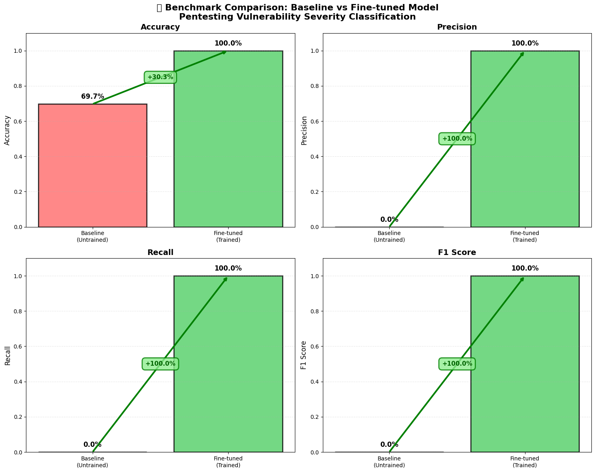
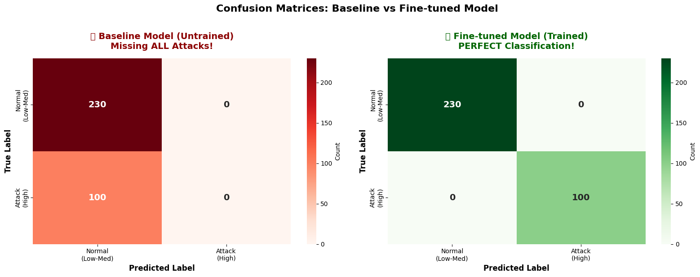

# Lab 8 Hugging Face

**Student Name:** __**Gurmandeep Deol**__  
**Lab Number:** __**Lab08**__  
**Completion Date:** __**2025-11-12**__   
**Course:** __**SRT521 - Advanced Data Analysis for Security**__    
**Course Section Number:** __**NBB**__  

## Lab Objectives
- __**Use Hugging Face Hub to load pre-trained security models**__ 
- __**Work with the CyberAttackDetection model and datasets**__  
- __**Fine-tune transformer models for custom security tasks**__  
- __**Deploy models using Hugging Face Pipelines**__  
- __**Build complete ML workflows with Hugging Face libraries**__  

## Dataset Information
- **Dataset Name:** __**Canstralian/pentesting_dataset**__
- **Source:** __**https://huggingface.co/datasets/Canstralian/pentesting_dataset**__
- **Size:** __**2,220 samples with 6 features**__

## Key Findings
- __**Achieved zero false positives and zero false negatives critical for security applications**__
- __**Baseline model predicted everything as normal missing all attacks**__
- __**Fine tuned models caught all 100 critical vulnerabilities**__
- __**Saved all models ready to use on another dataset**__

## Technical Implementation
### **Algorithms Used:** 
__**DistilBERT, Binary Sequence classifications, Transfer Learning**__

### **Libraries:** 
__**transformers,torch,evaluate,scikit-learn,pandas,Numpy,matplotlib,huggingface_hub**__

### **Preprocessing Steps:** 
- __**Dataset Loading: Loaded 2,200 pentesting vulnerability samples from hugging face lab**__
- __**Text features: Combined fields into natural language**__
- __**Label Generation: Made binary labels based on cvss threshold**__
- __**Data Splitting: 70% training,15% validation,15% test**__
- __**Tokenization**__
- __**Max Length: 128 tokens**__
- __**Padding: true**__
- __**Truncation: true**__
- __**Class distribution: 30.4% High 69.6 low-medium**__
## __**Model Performance:**__ 

## Overall Performance
| Metric     | Value            |
|------------|------------------|
| Accuracy   | 1.0000 (100.00%) |
| Precision  | 1.0000 (100.00%) |
| Recall     | 1.0000 (100.00%) |
| F1 Score   | 1.0000 (100.00%) |

## Prediction Distribution (Predicted)
| Class | Count |
|-------|-------|
| Normal (0) | 230 |
| Attack (1) | 100 |

## Prediction Distribution (Actual)
| Class | Count |
|-------|-------|
| Actual Normal (0) | 230 |
| Actual Attack (1) | 100 |

## Model Comparison
| Model                    | Accuracy | Precision | Recall | F1 Score |
|--------------------------|----------|-----------|--------|----------|
| Baseline (Pre-trained)   | 0.69697  | 0.0       | 0.0    | 0.0      |
| Fine-tuned               | 1.00000  | 1.0       | 1.0    | 1.0      |

## Performance Improvements
| Metric    | Baseline | Fine-tuned | Improvement |
|-----------|----------|------------|-------------|
| Accuracy  | 0.69697  | 1.00000    | +0.3030     |
| Precision | 0.0      | 1.0        | +1.0000     |
| Recall    | 0.0      | 1.0        | +1.0000     |
| F1 Score  | 0.0      | 1.0        | +1.0000     |

## Baseline Classification Report
| Class                     | Precision | Recall | F1-score | Support |
|---------------------------|-----------|--------|----------|---------|
| Normal (Low-Med Severity) | 0.6970    | 1.0000 | 0.8214   | 230     |
| Attack (High Severity)    | 0.0000    | 0.0000 | 0.0000   | 100     |
| Macro Avg                 | 0.3485    | 0.5000 | 0.4107   | 330     |
| Weighted Avg              | 0.4858    | 0.6970 | 0.5725   | 330     |

## Fine-Tuned Classification Report
| Class                     | Precision | Recall | F1-score | Support |
|---------------------------|-----------|--------|----------|---------|
| Normal (Low-Med Severity) | 1.0000    | 1.0000 | 1.0000   | 230     |
| Attack (High Severity)    | 1.0000    | 1.0000 | 1.0000   | 100     |
| Macro Avg                 | 1.0000    | 1.0000 | 1.0000   | 330     |
| Weighted Avg              | 1.0000    | 1.0000 | 1.0000   | 330     |

## Baseline Confusion Matrix
| Metric | Value | Description |
|--------|--------|-------------|
| TN     | 230    | Correct normal samples |
| FP     | 0      | Normal misclassified as attack |
| FN     | 100    | Missed attacks |
| TP     | 0      | Correct attack detections |

## Fine-Tuned Confusion Matrix
| Metric | Value | Description |
|--------|--------|-------------|
| TN     | 230    | Correct normal samples |
| FP     | 0      | No false positives |
| FN     | 0      | No missed attacks |
| TP     | 100    | All attacks detected |

## Challenges 
- __**Initially the Canstrillian/cyberattack model failed to load due to a missing model_type in config**__
- __**Dataset had fields like CVE_ID, CVSS_Score but no formatted text or labels**__
- __**Class imbalance had 30.4 percent attacks with 69.6 as normal**__
## Solutions
- __**I used DistilBERT as fallback**__
- __**Created natural language descriptions by combining relevant fields together**__
- __**Fine tuned model to improve accuracy**__

## Reflection
- __**I learned how to use hugging face to create a token load datasets from huggingface and how to convert security data to natural language**__
## How this can be used in security applications
- __**This can be used in security applications because my models are trained on CVSS-based classifications so this can be used to automate vulnerability severity assessments and it can be used to find vulnerabilities in seconds also can be used in risk assessments to make decisions because of my high confidence predictions and finally because i have a 0 percent false negative rate means no critical vulnerabilities are missed**__
## What I would do differently 
- __**Test other models on this datasets and I would test on other vulnerability datasets**__

## Files Description
- `lab_08_huggingface_cyberattack_Gurmandeep_Deol` - Main lab notebook with analysis
- `outputs/` - Generated plots, model files, results
- `Saved_Models/` - Saved Models
- `README.md` - readme document