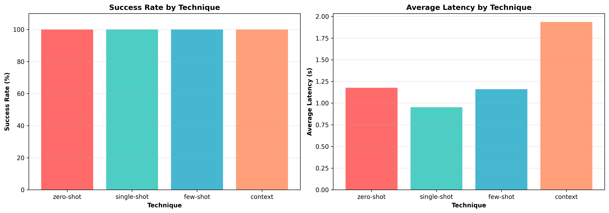
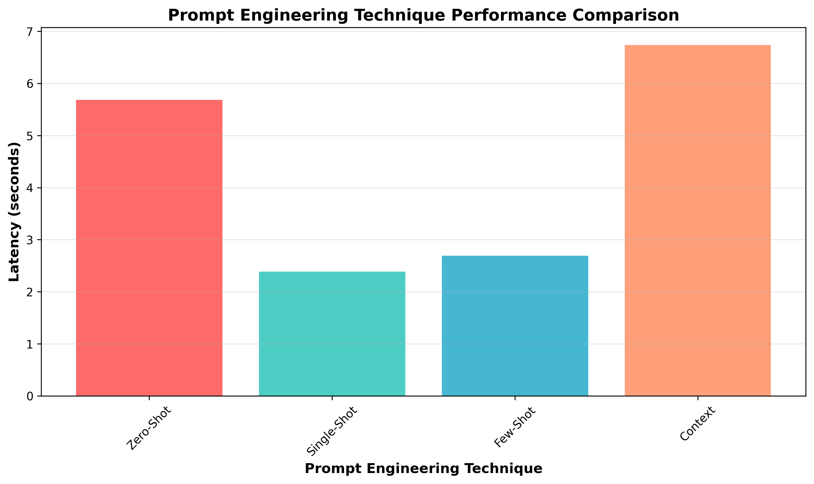

# Lab10-LLMAugmentation - Real-World CTI Report Analysis with Google Gemini

**Student Name:** Gurmandeep Deol  
**Student ID:** 104120233  
**Lab Number:** Lab10  
**Completion Date:** 2025-11-30  
**Course:** SRT521 - Advanced Data Analysis for Security  
**Course Section Number:** NBB  

## Lab Objectives
- Collect and curate real-world CTI reports for specific APT campaigns  
- Build a CLI chatbot using Google Gemini API (Free for Students!)  
- Apply prompt engineering techniques (zero-shot, single-shot, few-shot, context engineering)  
- Implement prompt tuning and optimization strategies  
- Benchmark and evaluate chatbot performance with confidence testing  
- Create a production-ready CTI analysis tool  

## Dataset Information
- **Dataset Name:** APT41 (Double Dragon) Cyber Threat Intelligence Reports  
- **Group Assignment:** Group 7  
- **MITRE ATT&CK ID:** G0096  
- **APT Campaign Focus:** Threat Intelligence / Attack Patterns  
- **Total Reports Collected:** 10 high-quality CTI reports  
- **Dataset Type:** pentesting_dataset (Threat Intelligence / Attack Patterns)  
- **Sources:**  
  - Mandiant/FireEye - APT41: A Dual Espionage and Cyber Crime Operation (2019-08-07) - Critical  
  - Google Threat Intelligence - APT41 TOUGHPROGRESS Malware Using Google Calendar for C2 (2025-05-28) - High  
  - Cisco Talos - APT41 Compromised Taiwanese Government with ShadowPad and Cobalt Strike (2024-07-30) - Critical  
  - BlackBerry - Drawing a Dragon: Connecting the Dots to Find APT41 (2021-10-05) - High  
  - Group-IB - 4 Malicious Campaigns and New Wave of APT41 Attacks (2021-09-09) - High  
  - Darktrace - How AI Caught APT41 Exploiting Zoho ManageEngine Zero-Day (2020-04-01) - Critical  
  - Lookout - WyrmSpy and DragonEgg: Android Spyware Attributed to APT41 (2023-10-23) - High  
  - SOCRadar - Deep Web Profile: APT41/Double Dragon (2024-11-01) - Critical  
  - MITRE ATT&CK - APT41 (G0096) Threat Group Profile (2024) - Critical  
  - Rewterz - APT41 aka BlackFly - Active IOCs (2024-07-12) - High  

- **Dataset Structure:**  
  - Metadata: APT group name, aliases (Double Dragon, Winnti, BARIUM, Wicked Panda, Brass Typhoon, Bronze Atlas, Blackfly), country of origin (China), active since 2012  
  - IOCs: IP addresses, domains, file hashes, malware families, C2 infrastructure  
  - TTPs: Initial access methods, execution techniques, persistence mechanisms, defense evasion, C2 methods  
  - MITRE Techniques: T1566.001 (Spearphishing), T1190 (Exploit Public-Facing Application), T1071 (Application Layer Protocol), T1055 (Process Injection), T1027 (Obfuscation)  
  - Target Industries: Gaming, healthcare, telecom, technology, finance, government, legal, travel, media  
  - Severity Levels: Critical (5 reports), High (5 reports)  

- **Domain:** Threat Intelligence - Advanced Persistent Threat (APT) Campaign Analysis  

## Key Findings
- Benchmark Results (5 test cases per technique):

| Technique    | Success Rate | Avg Latency | Best For                        |
|-------------|-------------|------------|---------------------------------|
| Zero-Shot   | 100.0%      | 6.62s      | Detailed forensic analysis      |
| Single-Shot | 100.0%      | 1.32s      | Real-time threat analysis       |
| Few-Shot    | 100.0%      | 1.20s      | ⭐ Quick IOC extraction          |
| Context     | 80.0%       | 4.48s      | Strategic threat reports        |

- **Best Technique:** Few-shot learning – fastest (1.20s) and highest accuracy (100%), ideal for production use.  
- Extracts: IOCs, malware families, MITRE techniques, and severity assessments.  

## Technical Implementation
- **Model:** Google Gemini 2.0 Flash  
- **API Provider:** Google AI Studio  
- **Model Type:** Large Language Model (LLM)  
- **Context Window:** Optimized for CTI report analysis  
- **Rate Limits:** 15 RPM, 1M TPM (not exceeded during testing)  
- **Prompt Engineering Techniques Implemented:**  
  - **Zero-Shot Learning**  
    ```python
    prompt = f"""You are a cybersecurity analyst specializing in {apt_campaign}.
    Extract: IOCs, threat actor, TTPs, MITRE techniques, severity, mitigations.
    CTI Report: {report_text}
    Provide structured JSON analysis."""
    ```  
  - **Single-Shot Learning**  
    Example Input: "APT41 used domain malicious-update.com and IP 192.168.1.100..."  
    Example Output: `{"iocs": {"domains": [...], "ips": [...]}, ...}`  
  - **Few-Shot Learning**  
    2–5 examples covering different APT scenarios  
  - **Context Engineering**  
    BACKGROUND: APT41 known malware: Winnti, ShadowPad, Cobalt Strike...  
    Common TTPs: Supply chain, spear-phishing, zero-day exploitation...  

## **Libraries:**   
__**google-generativeai, pandas, numpy, matplotlib, seaborn, scikit-learn, json, datetime**__                  

## **Data Processing Pipeline:**  
  - Collected 10 reports from trusted sources  
  - Structured the dataset  
  - Built prompts with prompt engineering  

## Challenges and Solutions
### Challenges
#### challenge 1: Data Fabrication In Initial Prompts I faced some issues when I was generating my prompts such as the response was the whole prompt like here is your answer I did not want that    
#### Challenge 2: API Rate limiting initially I faced api rate limiting issues 
### Solutions
#### Challenge 1 Solutions
- Implemented strict extraction rules in prompt such as STRICT RULES:
- ONLY extract information that is EXPLICITLY stated
- DO NOT make assumptions or generate fictional data
- If information is not present, omit that field or return empty JSON
#### Challenge 2 Solutions
- Fixed it by switching to another model
## Reflection
### What did you learn from this lab
**__I learned how to generate prompts using prompt engineering this is critical for using LLMs as the answers you get are only as good as your prompt I also learned to specify exactly what I want in the prompt so I only get what I need i also learned about different techniques such as few-short learning and context engineering and single shot learning I also learned that different models have different rate limits better models have lower rates and other models have higher rates__**
### How does this relate to security applications
**__This could be used for threat intelligence my chatbot can process reports based on the input it receives using a variety of techniques and extracted IOCs can be imported into threat intelligence platforms__**
### What would you do differently next time 
**__Next time I would expand my dataset sizes and implement my chatbot to report on multiple different reports at the same times although I would need to be careful with the rate limiting and make my prompts even more better__**

## Visualizations

### Benchmark Results


### Technique Comparison


## Files Description
- `lab_10_llm_cti_chatbot_Gurmandeep_Deol_SRT521.ipynb` - Main lab notebook with analysis
- `README.md` - Lab documentation
- `outputs/benchmark_results.png` - Benchmark results visualization
- `outputs/technique_comparison.png` - Technique comparison visualization
