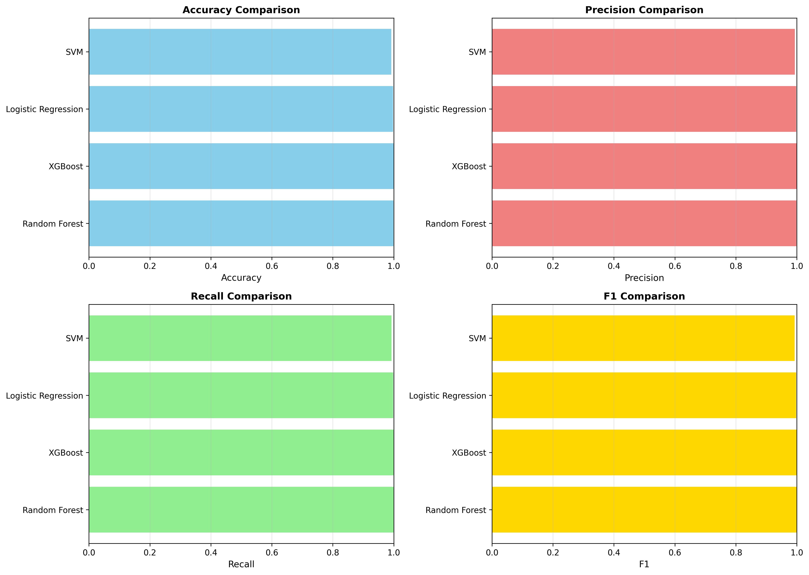
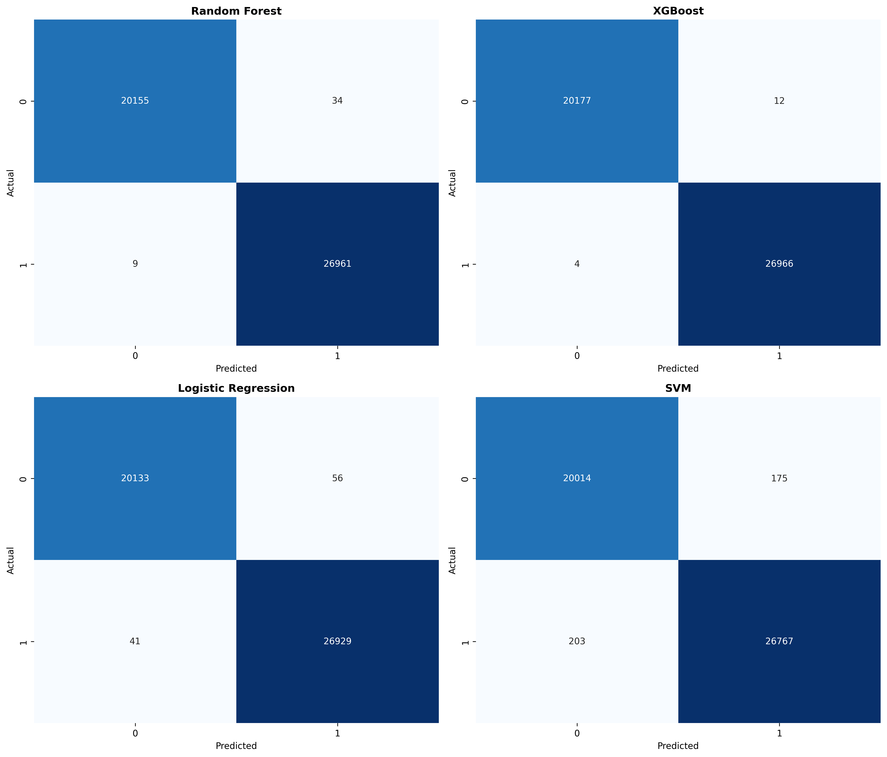

# Assignment 1 - Phishing Detection ML Pipeline

**Student Name:** Gurmandeep Deol  
**Student ID:** 104120233  
**Assignment Number:** Assignment 1  
**Completion Date:** 2025-11-01  
**Course:** SRT521 - Advanced Data Analysis for Security  
**Course Section Number:** (NBB)  
**Instructor:** Hamed Haddadpajouh  
## Demonstration Note To Professor
__**I demonstrated my assignment 1 to you in class professor I just wanted to let you know because you said to write this in our README**__

## Overview
__**This assignment had me implement a complete machine learning pipeline for phishing detection identifying malicious websites from legitimate websites In this pipeline I have**__
 
- __**Tested 6 different phishing datasets (binary)**__
- __**4 machine learning algorithms (Random Forest,XGBoost,Logistic Regression, SVM)**__
- __**8 custom phishing features such as (URL structure, content analysis, trust signals)**__
- __**Comprehensive Evaluation (accuracy,precision,recall,F1,AUC-ROC)**__
- __**Advance analysis (cross-validation,hyperparameter tuning,clustering)**__
- __**error handling model persistence auto reporting**__
## Assignment Objectives
- __**Implement a complete ML pipeline from data preprocessing to model evaluation**__
- __**Compare multiple traditional machine learning algorithms**__
- __**Apply appropriate evaluation metrics for security problems**__
- __**Conduct thorough error analysis and feature importance analysis**__
- __**Write a comprehensive technical report**__

## Installation
- Clone my repository 
- cd assignment-1
- check that you have python installed by running python --version
- install dependencies by running pip install -r requirements.txt
- Run the main.py
- choose what you want to do such as 9 run complete pipeline which runs everything
- enter your dataset path
- confirm the target selection by default it will try to auto detect but you can change it
- press enter for each step
- results will be saved in outputs/ saved_models/ and reports/

## Module Documentation
### Data Loading data/loader.py
**__Purpose load csv files with automatic encoding detection and target column identification__**
### Preprocessing preprocessing/cleaner.py
**__purpose: creates domain-specific phishing detection features from the csv raw data and cleans the data such as filling in any missing values__**
### model training models/trainer.py
**__Purpose: train machine learning models and perform hyperparameter tuning__**
### model evaluation models/evaluator.py
**__Purpose: calculate performance metrics and analyze errors__**
### Clustering models/clustering.py
**__Purpose: Unsupervised learning to find patterns without labels__**
### Visualizations utils/visualizer.py
**__purpose: generate plots for analysis and reports__**
### Utilities utils/helpers.py
**__purpose: model persistence and report generation__**

# Datasets I have tested
| Dataset       | Samples | Features | Target / Label        | Notes                          |
|----------------|----------|-----------|------------------------|---------------------------------|
| **dataset1.csv** | 11,055  | 32        | Result (-1/1)          | Traditional phishing indicators |
| **dataset2.csv** | 88,647  | 112       | phishing (0/1)         | Detailed URL parsing features   |
| **dataset3.csv** | 11,430  | 89        | status                 | Comprehensive web analysis      |
| **dataset4.csv** | 235,795 | 56        | label (0/1)            | Large-scale feature engineering |
| **dataset5.csv** | [Failed] | [Unknown] | [Unknown]              | Requires cleaning               |
| **dataset6.csv** | 10,000  | 50        | CLASS_LABEL (0/1)      | Balanced classification set     |
# Supported Formats:
**__Binary Classification (2 classes)__**  
**__Numeric Labels (-1/1,0/1,1/,etc.)__**  
**__string labels ("legitimate"/"phishing")__**  
**__gaps in labels (1,2,22,23) automatically fixed__**  

### Typical Performance (Dataset 4 – 235K samples)

| Model               | Accuracy | Precision | Recall | F1 Score | Training Time     |
|----------------------|-----------|------------|---------|-----------|-------------------|
| XGBoost             | 99.96%   | 99.94%     | 99.99% | 99.96%    | ~30s              |
| Random Forest       | 99.91%   | 99.87%     | 99.97% | 99.92%    | ~45s              |
| Logistic Regression | 99.81%   | 99.81%     | 99.86% | 99.84%    | ~5s               |
| SVM                 | 99.19%   | 99.30%     | 99.28% | 99.29%    | ~2m (5K subset)   |

## Key Findings
- tree based models such as XGBoost, RandomForest outperform other linear models
Feature engineering improves F1 by 5-10%
cross validations verify's models stability
Top Features are URL Length, trust signals

## Technical Implementation
### **Algorithms Used:** __Random Forest__, __XGBoost__, __Logistic Regression__, __Support Vector Machine__  
### **Libraries:** __scikit-learn__, __xgboost__, __pandas__, __numpy__, __matplotlib__, __seaborn__, __pickle__
### **Preprocessing Steps:** 
### Data Loading
- **__Automatic encoding detection tries 8 different encodings__**
- **__Auto corrects window path such as backlash__**
### Data Cleaning
- **__Missing value detection__**
- **__Duplicate row removal__**
- **__Data type validation and conversion to numeric__**
### Feature Engineering
- **__Generating 8 new features__**
### Label Encoding
- **__Converts any label formats to continous__**
- **__Handels binary (-1.1) strings ("phishing,"legitimate) gaps in labels__**
- **__Required for XGBoost compatibility__**
### Data Splitting
- **__80% training 20% testing__**
## Model Performance Summary
- **__Best Model: XGBoost__**
- **__Accuracy:99.96%__**
- **__Precision: 99.94%__**
- **__Recall: 99.99__**
- **__F1 Score 99.96%__**
- **__AUC-ROC: 0.9998__**
- **Model Performance:**

## Challenges and Solutions
- **__Challenge 1: could not load files with encoding__**
- **__The solution was to edit the data loading file and make sure it could properly read csv files even with different encodings__**
- **__Challenge 2: is some models such as XGBoost had invalid classes inferred error some class labels had gaps such as 1,2,22,23__**  
- **__The solution was to have these handled automatically by the encode_target() function__**
- **__Challenge 3: was for some datasets I got an ROC curve error: y should be 1d array__**
- **__The solution was to fix the visualizations file the plot_roc_curves() function__**
- **__Challenge 4: was when initially running my code I got module not found error__**
- **__I fixed this by putting all the libraries I would need in my requirements.txt file and running the file__**

## Files Description
- `outputs/`
- `reports/`
- `mkdocs.yml`
- `requirements.txt`
- `outputs/` - Generated plots, model files, results
- `src`- all python files
