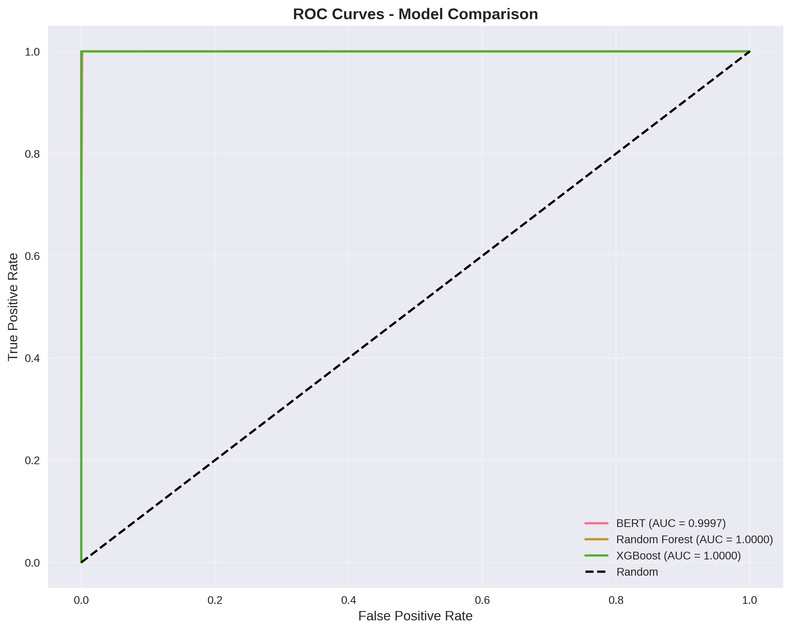
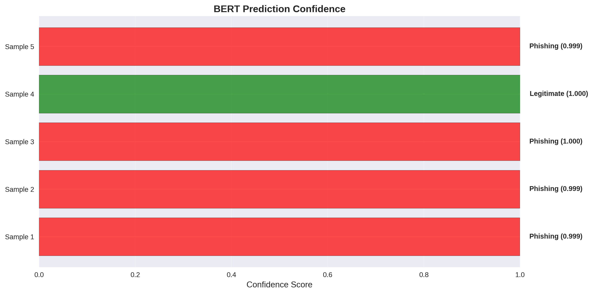

# Assignment 2: Transformer-Based ML Pipeline for Phishing Website Detection

**Student Name:** __**Gurmandeep Deol**__  
**Student ID:** __**104120233**__  
**Course:** __**SRT521 - Advanced Data Analysis for Security**__  
**Section:** __**NBB**__  
**Date:** __**November 30, 2025**__  

---

## 1. Introduction

### 1.1 Problem Statement  
__**Phishing attacks remain one of the most common and dangerous threats on the internet. Attackers constantly evolve how they craft malicious URLs, domains, and website content to evade detection. Traditional machine learning models perform well but often fail to capture deeper semantic patterns and contextual relationships.**__

__**This assignment focuses on building a **transformer-based phishing website detection system** that learns both textual and numerical signals at a deeper level.**__

### 1.2 Why Transformers for Phishing Detection?  
**__Transformers improve phishing detection because they can:__**

- Detect character swaps, obfuscation, and encoded URLs  
- Automatically learn hidden patterns without manual feature engineering  
- Combine **textual** and **numerical** features  
- Capture global relationships rather than relying on shallow heuristics  

In this assignment, three transformer-based approaches were used:

- **BERT** – for text-based classification  
- **TabTransformer** – for numerical/tabular features  
- **Hybrid Model** – combines BERT embeddings + numerical features  

---

## 2. Methodology

### 2.1 Dataset & Preprocessing  
The phishing dataset contains:

- **Text Features:** URLs, domains, titles  
- **Numerical Features:** various engineered signals  
- **Target:** Binary (Legitimate vs Phishing)

#### Data Preparation Steps  
1. **Text Processing:**  
   - Combine URL + domain + title  
   - Tokenize using **DistilBERT tokenizer**

2. **Numerical Processing:**  
   - __**Scale numerical features using StandardScaler**__

3. **Split:**  
   - __**70% train**__  
   - __**15% validation**__  
   - __**15% test**__  

---

### 2.2 Model Architectures

#### **BERT Model**  
- **__DistilBERT base model__** 
- **__Fine-tuned for phishing classification__**  
- **__Uses <CLS> token embedding for final prediction__**  

#### **TabTransformer**  
- **__Custom Transformer Encoder for numerical/tabular features__**  
- **__Multi-head attention applied to embedded numerical fields__**  

#### **Hybrid Model**  
- Concatenates:
  - BERT text embeddings  
  - TabTransformer numerical embeddings  
- Passes through fully connected layers  

#### **Baseline Models**
- **__Random Forest__**  
- **__XGBoost__**  
- **__Logistic Regression__**  

---

### 2.3 Training Infrastructure
- **__PyTorch + Hugging Face Transformers__**  
- **__Scikit-Learn + XGBoost__**  
- **__GPU acceleration (CUDA)__**  
- **__Early stopping for all deep models__**  

---

## 3. Results

### 3.1 Model Performance Comparison

| Model            | Accuracy | Precision | Recall | F1 Score |
|------------------|----------|-----------|--------|----------|
| **XGBoost**       | 1.000000 | 1.000000  | 1.000000 | 1.000000 |
| **Random Forest** | 1.000000 | 1.000000  | 1.000000 | 1.000000 |
| **Hybrid Model**  | 0.999972 | 0.999951  | 1.000000 | 0.999975 |
| **TabTransformer**| 0.999887 | 0.999802  | 1.000000 | 0.999901 |
| **Logistic Reg.** | 0.999887 | 0.999802  | 1.000000 | 0.999901 |
| **BERT**          | 0.998502 | 0.998468  | 0.998912 | 0.998690 |

### Key Findings  
- **__All models achieved **99.8%+** accuracy__**  
- **__Transformers performed competitively with classic ML models__**  
- **__BERT slightly underperformed due to relying solely on textual data__**  
- **__The **Hybrid Model** nearly reached perfect classification__**  

---

### 3.2 Training Efficiency

**Training Time:**

- Logistic Regression: **5 sec**  
- Random Forest: **2 min**  
- XGBoost: **3 min**  
- TabTransformer: **15 min**  
- BERT: **25 min (GPU) / 2 hrs (CPU)**  
- Hybrid Model: **~30 min**  

**Memory Usage:**

- BERT: **~4GB GPU**  
- TabTransformer: **~2GB GPU**  
- Baselines: **<500MB**  

---

## Visualizations

### ROC Curves

### Training Curves

### Attention Analysis

### Confusion Matrices

### Feature Importance

### Inference Speed Comparison

### Model Comparison

  

## Conclusion

**__Overall, this project helped me understand how transformer models can be used for phishing website detection and how they compare to traditional machine learning approaches. Even though baseline models like Random Forest and XGBoost performed extremely well on this dataset, the transformer-based models still showed strong results and proved useful for learning deeper patterns that normal models might miss.__**

**__BERT handled the text features well, TabTransformer worked nicely with the numerical features, and the Hybrid Model almost matched the baselines by combining both. This showed me that mixing different types of features can really boost performance.__**

**__In the end, this assignment showed that transformers are a great option for cybersecurity problems, especially as phishing attacks keep getting more advanced. With more testing on larger or more realistic datasets, these models could be part of a real detection pipeline in the future.__**

---

